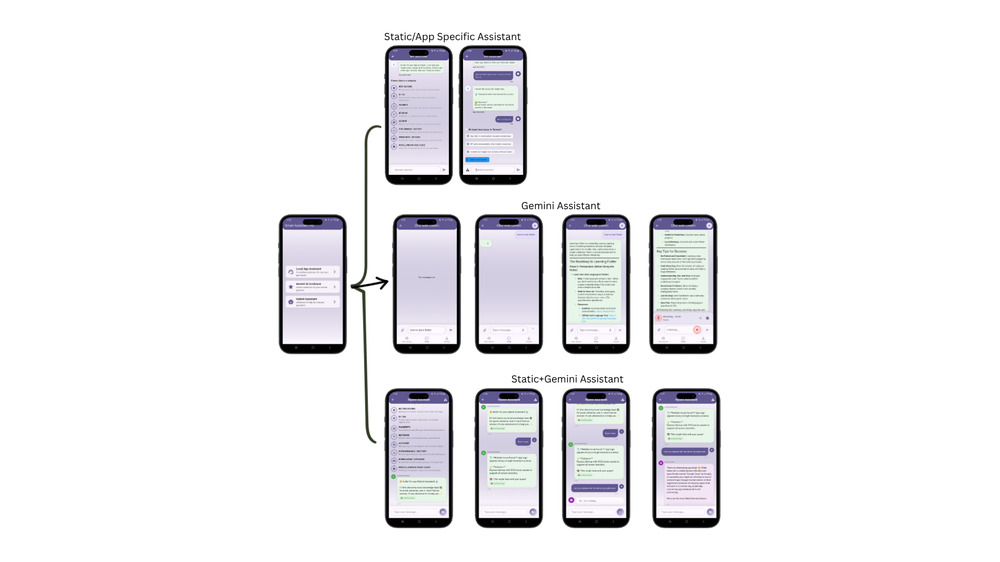
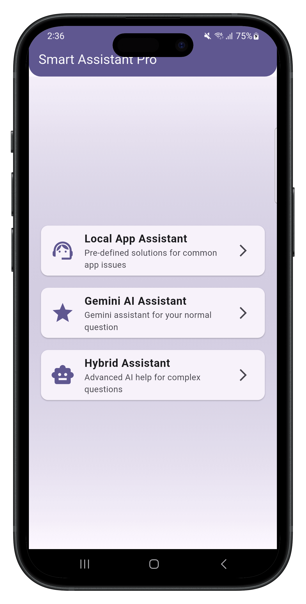
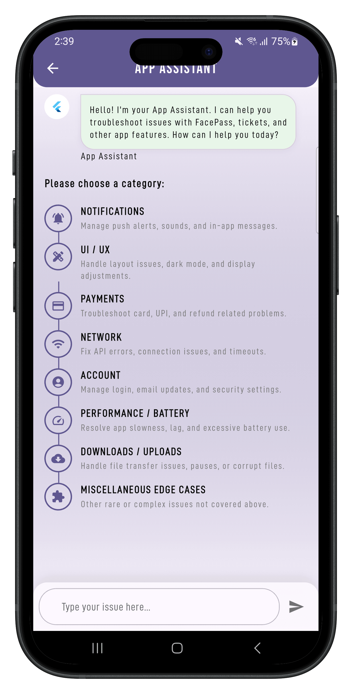

# 📱 Flutter Gemini Smart Assistant

A Flutter-based intelligent assistant application that combines static JSON knowledge base with Google Gemini AI for a comprehensive support experience. Choose between three different assistant modes based on your needs.

---



## 🚀 Features

### 🤖 Three Assistant Modes
1. **App Assistant (Static JSON-based)**
  - Local knowledge base with pre-defined solutions for common app issues
  - Category-based navigation with intuitive UI
  - Keyword matching for quick problem resolution
  - Fallback options (FAQ, Contact Us, Raise Request) after 3 unrecognized queries

2. **AI Assistant (Gemini AI-powered)**
  - Advanced AI conversations using Google Gemini API
  - Natural language processing for complex queries
  - Image support - upload images for AI analysis
  - Chat history with persistent storage

3. **Hybrid Assistant (Best of Both Worlds)**
  - Smart routing - first checks local knowledge base, then falls back to AI
  - Visual indicators showing source of response (Local 📚 vs AI 🤖)
  - Seamless integration between static content and AI capabilities
  - Optimized performance with fast local responses for common issues

---

## 🎯 Core Features

### 📚 Local Knowledge Base
- Static JSON-based responses loaded from assets folder
- Structured categories: Notifications, UI/UX, Payments, Network, Account, Performance, Downloads, Miscellaneous
- Keyword matching with fuzzy search capabilities
- Quick solutions for common app issues

### 🧠 AI-Powered Intelligence
- Google Gemini AI integration for complex queries
- Natural language understanding
- Image analysis and description
- Context-aware responses

### 🔄 Smart Hybrid System
- Intelligent routing - local first, AI fallback
- Visual source indicators (Green for local, Purple for AI)
- Typing indicators during AI processing
- Seamless user experience

### 🎨 Enhanced UI/UX
- Beautiful gradient backgrounds and modern design
- Distinct message bubbles for user, local assistant, and AI
- Smooth animations and transitions
- Responsive design for all screen sizes

---

## 📸 Screenshots

🏠 **Home Screen - Assistant Selection**  


📱 **App Assistant - Local Knowledge**  
 

🤖 **AI Assistant - Gemini AI**  


🔄 **Hybrid Assistant - Smart Routing**  
 

---

## 🏗️ Project Architecture

```
lib/
├── main.dart                 # App entry point with provider setup
├── gen_ai/                  # Gemini AI integration
│   ├── providers/
│   │   ├── chat_provider.dart
│   │   └── settings_provider.dart
│   ├── models/
│   │   └── message.dart
│   ├── screens/
│   │   ├── home_screen.dart
│   │   ├── chat_screen.dart
│   │   └── profile_screen.dart
│   └── widgets/             # Reusable UI components
├── assistant/               # Static chat assistant
│   ├── models/
│   │   └── issue.dart
│   ├── ui/
│   │   ├── app_assistant.dart
│   │   ├── profile_page.dart
│   │   └── view/           # UI components
│   └── utils/              # Helper utilities
├── hybrid/                 # Hybrid assistant
│   └── hybrid_chat_screen.dart
assets/
├── app_full_issues.json    # Local knowledge base
└── screenshots/           # App demonstration images
```

---

## 🛠️ Tech Stack
- **Flutter (Dart)** - Cross-platform framework
- **Google Gemini AI** - Advanced AI capabilities
- **Provider** - State management
- **Hive** - Local database for chat history
- **Static JSON** - Local knowledge base
- **Image Picker** - Image upload functionality

---

## ⚡ Getting Started

### Prerequisites
- Flutter SDK
- Google Gemini API Key
- Android Studio / VS Code

### Installation

Clone the repository:
```bash
git clone https://github.com/your-username/flutter-smart-assistant-pro.git
cd flutter-smart-assistant-pro
```

Install dependencies:
```bash
flutter pub get
```

Configure API Key:
```dart
class ApiService {
    static String apiKey = 'YOUR_GEMINI_API_KEY_HERE';
}
```

Run the application:
```bash
flutter run
```

---

## 📖 Usage Guide

### 🎯 Choosing Your Assistant
- **App Assistant** - For quick, pre-defined solutions to common issues
- **AI Assistant** - For complex, open-ended questions and image analysis
- **Hybrid Assistant** - For the best of both worlds (recommended)

### 🔧 App Assistant Features
- Browse categories or type specific issues
- Get instant solutions from local knowledge base
- Access FAQ, Contact Us, and Raise Request options

### 🧠 AI Assistant Features
- Natural conversations with AI
- Image upload and analysis
- Persistent chat history
- Advanced problem-solving

### 🔄 Hybrid Assistant Features
- Automatic routing between local and AI responses
- Visual indicators showing response source
- Fast responses for common issues + AI for complex ones

---

## 🎨 Customization

### Adding New Local Solutions
Edit `assets/app_full_issues.json`:

```json
{
  "id": "CUSTOM-001",
  "category": "Your Category",
  "title": "Issue Title",
  "scenario": "Problem description",
  "rootCause": "What causes the issue",
  "solution": "Step-by-step solution",
  "keywords": ["keyword1", "keyword2"],
  "action": "optional_action"
}
```

### Theming
Modify `lib/gen_ai/themes/my_theme.dart` for custom colors and styling.

---

## 🤝 Contributing
We welcome contributions! Please feel free to submit pull requests or open issues for:
- New local solutions for common app issues
- UI/UX improvements
- Performance optimizations
- Additional features

---

## 📜 License
This project is licensed under the **MIT License** - see the LICENSE file for details.

---

## 🆘 Support
- 📧 Email: support@yourapp.com
- 🌐 Website: https://yourapp.com
- 📱 In-app: Use the "Contact Us" option in any assistant mode

---

## 🚀 Future Enhancements
- Voice input/output support
- Multi-language support
- Advanced analytics
- Push notifications for ticket updates
- Integration with external ticketing systems

---

Built with ❤️ using Flutter & Google Gemini AI
