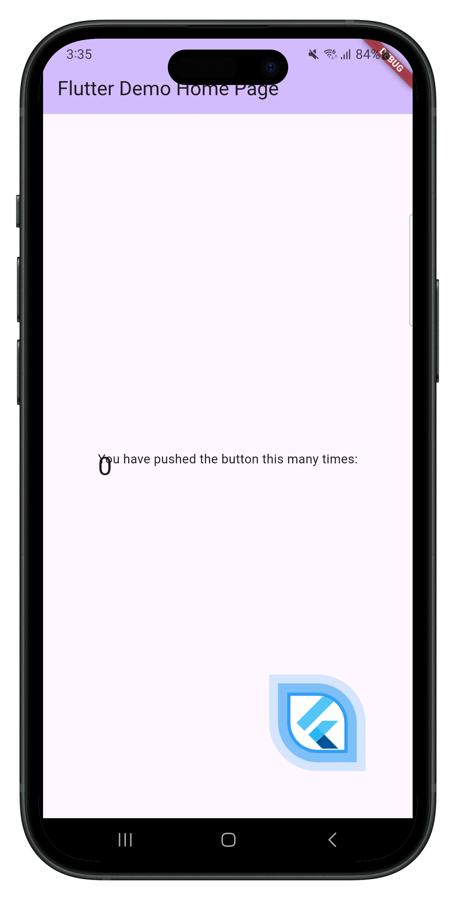
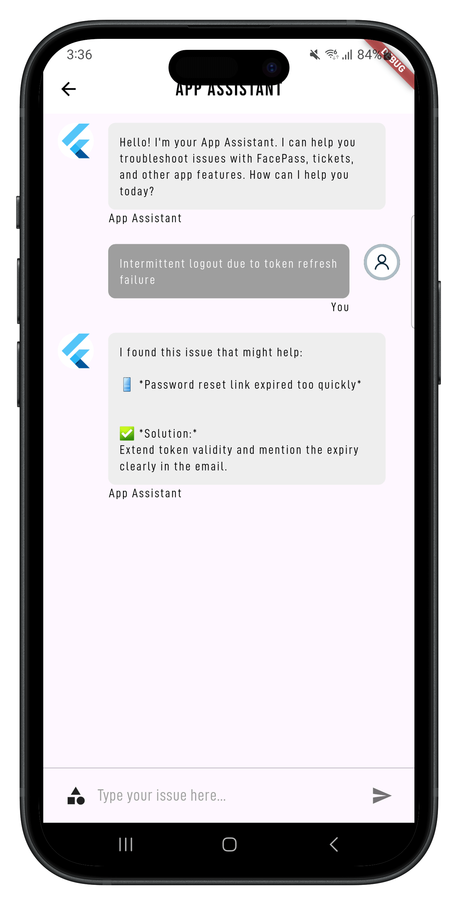
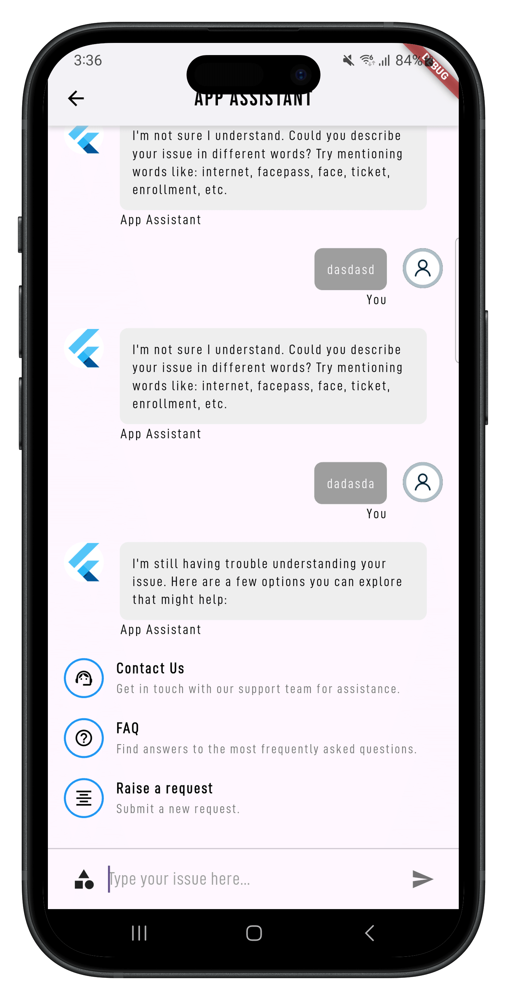

# 📱 Flutter Static Chat Assistant

A **Flutter-based static chat assistant** application that simulates a chatbot experience by fetching responses from **static JSON files** stored in the assets folder. This project demonstrates structured chat flows, keyword-based suggestions, and navigation to various support pages like **FAQ**, **Contact Us**, and **Raise a Request**.

---

## 🚀 Features

- **Static JSON-based Chat Flow**  
  Loads categories, suggestions, and solutions from a JSON file inside the assets folder.

- **Initial Category Suggestions**  
  Displays categories on startup for users to choose from.

- **Dynamic Suggestions & Solutions**  
  Selecting a category reveals corresponding suggestions, and selecting a suggestion shows its solution.

- **Keyword Search** 🔍  
  If a user types a keyword that matches any category or suggestion, the assistant displays the relevant suggestion or solution.

- **Fallback Handling** ⚠️  
  If the assistant doesn’t understand the query **3 consecutive times**, additional help options appear:
    - **Contact Us** → Navigates to a support/contact page
    - **FAQ** → Navigates to a FAQ list page
    - **Raise a Request** → Opens a form where users can submit their issue

- **Profile Page Navigation** 👤
  User can navigate to the profile page from the assistant.

---

## 📂 Project Structure

```
assets/
 └── chat_data.json   # Static JSON file containing categories, suggestions, and solutions
lib/
 ├── main.dart        # App entry point
 ├── chat_screen.dart # Chat assistant screen UI & logic
 ├── faq_page.dart    # FAQ list page
 ├── profile_page.dart# Profile page
 └── request_form.dart# Raise request form page
```

---

## 📸 Screenshots

### 1️⃣ Initial Chat Screen with Suggestions


### 2️⃣ Category & Suggestions Display


### 3️⃣ Fallback with FAQ, Contact Us, Raise Request Options


---

## ⚡ Getting Started

### Prerequisites
- [Flutter SDK](https://flutter.dev/docs/get-started/install)
- Android Studio / VS Code

### Installation
```bash
git clone https://github.com/your-username/flutter-static-chat-assistant.git
cd flutter-static-chat-assistant
flutter pub get
flutter run
```

---

## 📖 Usage

1. Start the app → Initial categories will appear.
2. Select a category → Suggestions will be displayed.
3. Select a suggestion → Solution will be shown.
4. Type a keyword → Assistant will show a related category/suggestion/solution.
5. If the assistant cannot understand 3 times → Options for **FAQ, Contact, Raise Request** appear.

---

## 🛠️ Tech Stack
- **Flutter** (Dart)
- **Static JSON (assets folder)**

---

## 🤝 Contributing
Pull requests are welcome! For major changes, please open an issue first to discuss what you would like to change.

---

## 📜 License
This project is licensed under the MIT License.

